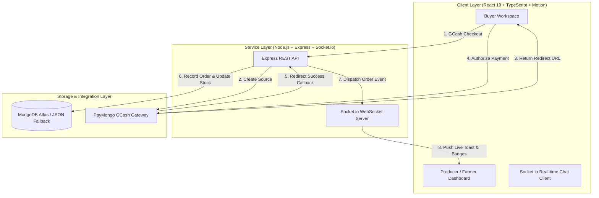

# 🌾 SmartAgriCraft 🎨

### _Oriental Mindoro's Digital Marketplace for Local Farmers & Artisanal Producers_

[](#-technical-stack)
[](#-database--storage-strategy)
[](#-payment--checkout-flow)
[](#-real-time-communications)

---

> [!NOTE]
>
> ### 🎓 Thesis Project Context
>
> **SmartAgriCraft** is developed as a **Thesis Project for John Paul College**.
> Designed specifically to address the economic realities of Oriental Mindoro, this platform serves as an direct-to-consumer digital bridge. It empowers local farmers, fishers, and indigenous craft producers by eliminating costly middlemen, facilitating direct commerce, and unlocking broader markets for regional products.

---

## 🚀 Overview

SmartAgriCraft is a high-fidelity, real-time web application crafted with a premium user experience in mind. The system is split into two primary paradigms: an intuitive, vibrant catalog for buyers looking for fresh crops and handwoven items, and a robust administrative suite for farmers and craft producers to manage listings, track analytics, and fulfill orders.

---

## ⚡ Architecture & Workflows

To support seamless trading, real-time chats, and immediate payments, SmartAgriCraft implements a cohesive multi-layered architecture:



---

## ✨ Key Features

### 👤 Role-Based Portals & Experiences

The application dynamically alters its workspace configuration and interface metrics based on the signed-in user's role:

- **Buyers:** Advanced marketplace exploration, local shopping cart isolation, unified checkouts, purchase history, delivery milestones, and ratings/reviews.
- **Farmers & Craft Producers:** Dedicated dashboard featuring revenue metrics, product listing creation with image previews, live order state configuration, low-stock warnings, and transaction breakdowns.

### 💬 Unified Real-Time Messaging Suite

Rather than cluttering the workspace with isolated, product-specific message feeds, SmartAgriCraft features a unified conversation engine:

- **1-to-1 Threading:** All interactions between a buyer and a producer are grouped into a single, high-fidelity chat.
- **Dynamic Attachments:** Integrated camera capture with automatic image rotation handling, real-time uploads, and previews.
- **Instant Presence:** Interactive online/offline badges, typing indicators, and socket-driven unread message counts.

### 💳 Complete PayMongo Payment Loop

Seamless processing for Philippines' local payment ecosystem:

- **GCash & Cards:** Integrated via the PayMongo API using secure source redirection.
- **Receipt Handshake:** Automated success/fail redirects with a verification step that monitors source charging before committing database changes.
- **Fallback Strategy:** Full support for Cash on Delivery (COD) workflows.

### 📈 Farmer / Producer Analytics

Producers are armed with commercial insights:

- **Visual Data representation:** Real-time dashboards visualizing revenue and units sold using responsive **Recharts** configurations.
- **Inventory Threshold Alerts:** Active status indications highlighting products with low stock count (`stock <= 5`).
- **Fulfillment Control:** Order pipeline tracking with simple state transitions (`pending → confirmed → dispatched → out_for_delivery → delivered`).

---

## 🛠 Technical Stack

### Frontend Core

- **React 19** — Highly responsive UI rendering.
- **TypeScript** — End-to-end type safety.
- **Vite** — Optimized, fast bundling.
- **Tailwind CSS v4** — High-performance utility styling.
- **Motion** — Fluid animations, micro-interactions, and visual feedback.
- **Recharts** — Dynamic administrative statistics.
- **Lucide React** — Premium typography icon pack.

### Backend & Database Services

- **Express & Node.js** — Fast server architecture.
- **Socket.io** — Real-time WebSockets bidirectional communication.
- **MongoDB Atlas (via Mongoose)** — Production-grade cloud data persistence.
- **JSON Adapter Fallback (`db.json`)** — Active repository pattern that automatically falls back to local file storage if MongoDB credentials are not present, ensuring flawless local execution.

---

## ⚙️ Configuration & Environment Setup

Create a `.env` or `.env.local` file in the root folder of the project with the following configuration parameters:

```env
# Server Configuration
PORT=3000
NODE_ENV=development

# Database Configuration (Optional - Falls back to local db.json if empty)
MONGODB_URI=mongodb+srv://<username>:<password>@<cluster>.mongodb.net/smartagri

# Payment Gateways
PAYMONGO_SECRET_KEY=pk_test_xxxxxxxxxxxxxxxxxxxxxxxx

# AI Studio App Integration
GEMINI_API_KEY=AIzaSyxxxxxxxxxxxxxxxxxxxxxxxx
```

---

## 💻 Running Locally

### Prerequisites

Make sure you have [Node.js](https://nodejs.org/) installed.

### Step-by-Step Setup

1.  **Clone the workspace** and navigate into the project directory:
    ```bash
    cd smartagri
    ```
2.  **Install dependencies:**
    ```bash
    npm install
    ```
3.  **Establish your credentials** in a local configuration file (`.env` or `.env.local`).
4.  **Execute the development environment:**
    ```bash
    npm run dev
    ```
5.  Open your browser and visit: `http://localhost:3000`

---

## 📦 Production Bundling

To package the application into an optimized build for deployment (e.g. Render, Heroku):

1.  **Compile and Bundle:**
    ```bash
    npm run build
    ```
2.  **Start production server:**
    ```bash
    npm start
    ```

---

<div align="center">
  <sub>SmartAgriCraft © 2026 John Paul College Thesis. Dedicated to the agricultural and artisanal community of Oriental Mindoro.</sub>
</div>
